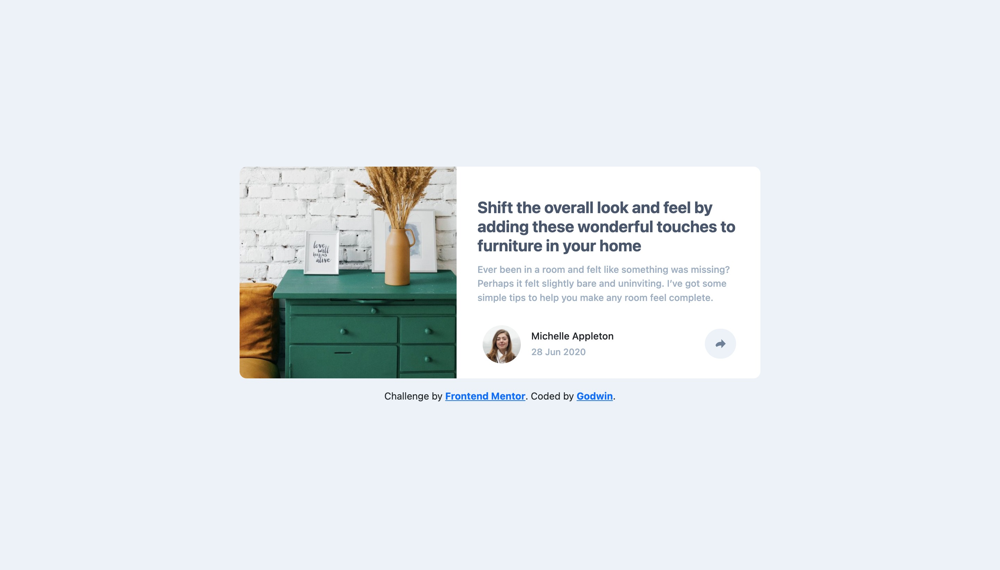
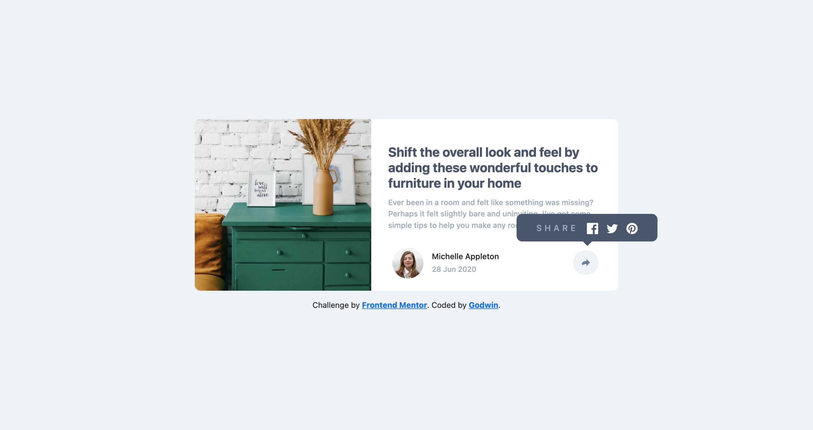
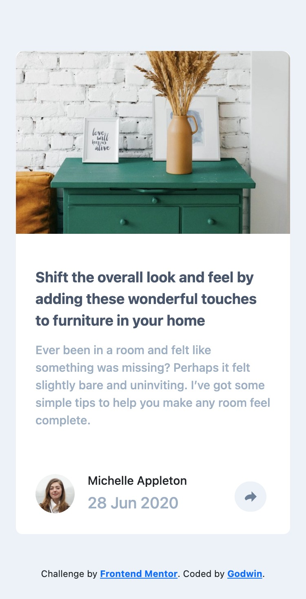
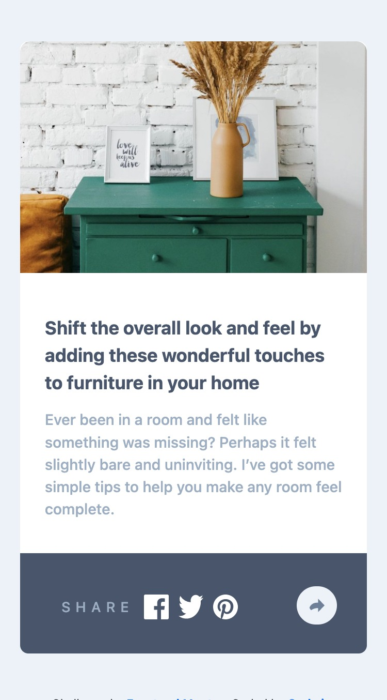

# Frontend Mentor - Article preview component solution

This is a solution to the [Article preview component challenge on Frontend Mentor](https://www.frontendmentor.io/challenges/article-preview-component-dYBN_pYFT). Frontend Mentor challenges help you improve your coding skills by building realistic projects. 

## Table of contents

- [Overview](#overview)
  - [The challenge](#the-challenge)
  - [Screenshot](#screenshot)
  - [Links](#links)
- [My process](#my-process)
  - [Built with](#built-with)
  - [What I learned](#what-i-learned)
  - [Continued development](#continued-development)
  - [Useful resources](#useful-resources)
- [Author](#author)

## Overview

### The challenge

Users should be able to:

- View the optimal layout for the component depending on their device's screen size
- See the social media share links when they click the share icon

### Screenshot
- Desktop view

- Desktop active state

- Mobile View

- Mobile Active state

### Links

- Solution URL: [Github](https://github.com/itadori-kun/Article-Preview-component.git)
- Live Site URL: [Netlify](https://article-preview-component-landingpage.netlify.app/)

## My process

### Built with

- Semantic HTML5 markup
- CSS custom properties
- Flexbox
- Bootstrap framework
- Vs code extension

### What I learned

- Learnt how to make a tooltip with css and javascript.
- Learnt how to use the bootstrap frame work.

### Continued development

-  Used bootstrap to help with responsiveness 
- Study more on manipulating with the bootstrap framework.

### Useful resources

- [Stackdairy.com/tooltip](https://stackdiary.com/snippet/hover-tooltip-javascript/) - This helped me in building the tooltip. I really liked this pattern and will use it going forward.

## Author

- Frontend Mentor - [@itadori-kun](https://www.frontendmentor.io/profile/itadori-kun)
- Twitter - [@yGodwincruise](https://www.twitter.com/Godwincruise)

